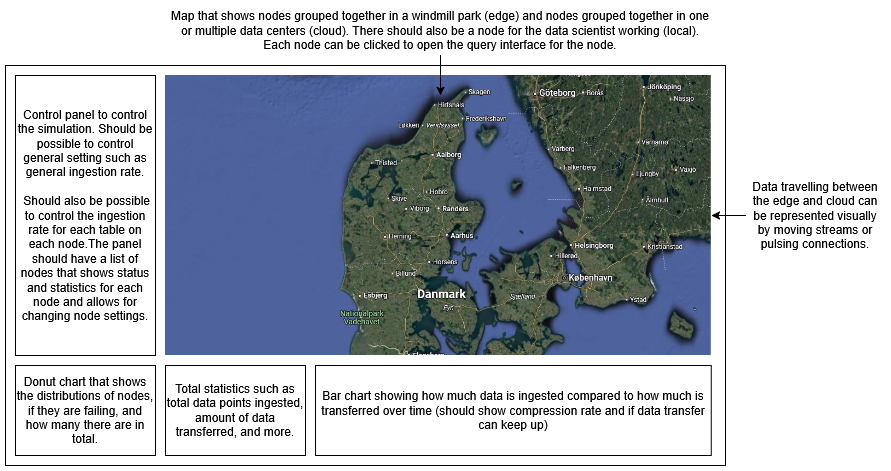
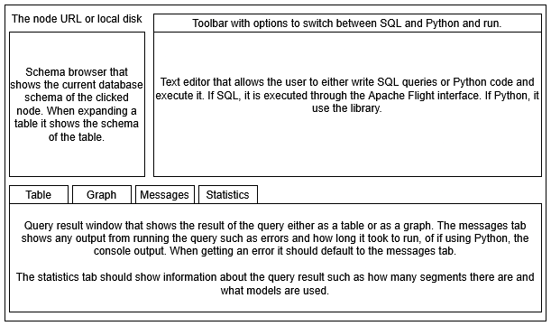

# ModelarDB Demo
This repository contains a demonstration of running a ModelarDB cluster in a distributed fashion. The demo is built using
Tauri and React. The demo is intended to be used as a proof of concept for the ModelarDB system and to show how it can be
used in a real-world scenario. The code in this repository is not intended to be used in a production environment.

## Ideas
* Demo app could be focused on a Google Maps style map with the nodes presented on the map itself.
  * Each node could show the metrics and have an icon that indicates it is online/transferring data.
  * General metrics like how many nodes there are of each type, how much data has been ingested and how much data has been 
    transferred (compression ratio) could be shown below the map.
  * This map page might not be relevant for the admin application but it could be used to demo on a website in the future as well.
  * Another page could be created which could have a query interface that could be directly copied to the admin application later.
    * This page should have a schema browser, text field for writing SQL, and a result window that shows the result in a 
      table and has an option to show the result in a graph.
    * The graph could also display information about which models were used to compress the data. 
    * Maybe make it a modal that is opened by clicking a node in the map.
      * Would be nice to always stay in the map.
  * There should be a node for the data scientist in the map that makes it possible to query local disk.
  * There should be nodes for the cloud nodes in the map that makes it possible to query the cloud.
  * There should be a focus on the amount of data, metadata about the data, and ModelarDB compression specific metadata such as model types.
  * We could maybe compare the system to an alternative such as Apache IoTDB.
    * Make it possible to turn up the ingestion rate and make it extremely visual that Apache IoTDB fails with a high 
      ingestion rate (anything short of alarm bells).
    * Maybe have ModelarDB and Apache IoTDB on the map at the same time (visually different) to make it easier to see 
      the difference in how they handle higher ingestion rates.
* To simulate data being ingested into the node we could set up a simple script that writes data into customizable 
  tables at a customizable ingestion rate for each node. 
  * This could also maybe be manually adjustable in the demo app by clicking the node on the map.
* Audience interaction is very important. 
* Should we add something to the demo that uses the Library more directly since the user interface obfuscates that there 
  is a Python interface with the same functionality?
  * Maybe add a separate windows in the query window that makes it possible to run Python code to access the system.
  * When the user clicks on a node it should default to SQL with Apache Arrow Flight and when clicking on data scientist 
    it should default to Python.

## Design
### Main interface

### Query Interface (Modal)

